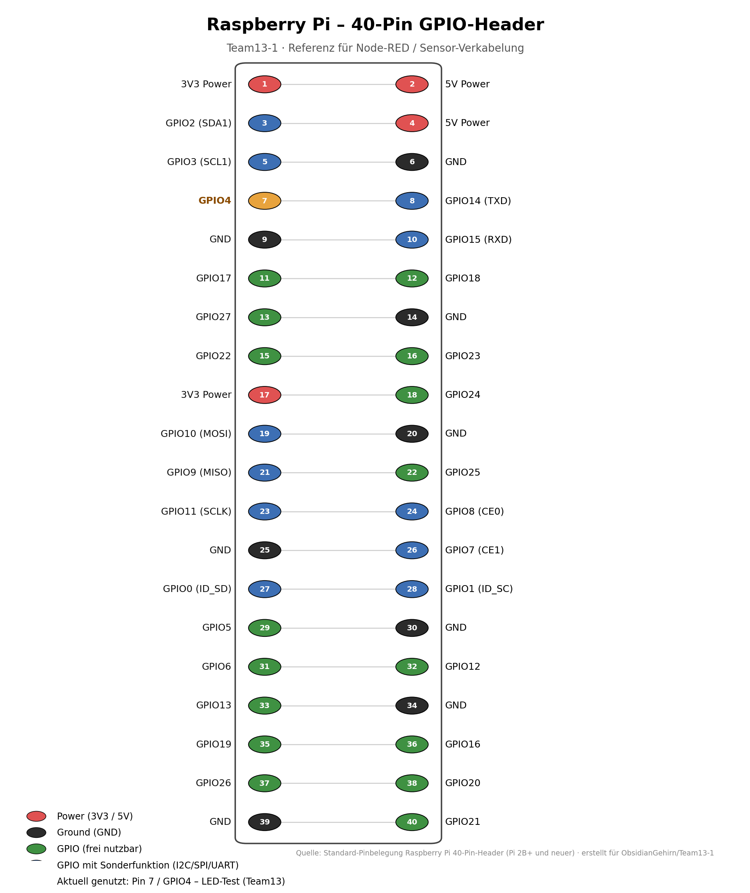

# Node-RED Flow: LED-Test

## Aktueller Stand
Zwei Inject-Buttons **"LED an"** (`payload: boolean true`) und **"LED aus"** (`payload: boolean false`) → verbunden mit einem `rpi-gpio out`-Node namens **"LED"** auf **GPIO4 / physischer Pin 7**, Typ "Digitaler Ausgang". Deployed und aktiv (Status "OK").

## Offen – Hardware-Aufbau
Anton muss noch LED + Vorwiderstand (330–470 Ω) auf ein Breadboard bauen:
- längeres LED-Bein → über Widerstand → GPIO4 / Pin 7
- kürzeres Bein → Ground-Pin (z.B. Pin 6 oder 9)

(siehe auch [[GPIO Pinbelegung]] für die volle Übersicht)

Danach im Node-RED-Editor (`http://team13-1.local:1880`) auf "LED an"/"LED aus" klicken zum Testen.

> [!note] Elektrotechnik-Grundlage
> Vorwiderstandsberechnung für LEDs wird im Kurs [[Kurs - Elektrotechnik]] behandelt (Kurs-ID 885).

## Nächster Schritt
MQTT-Anbindung des Flows – siehe [[Kurs - MQTT]] und [[Offene Punkte]].

## Verwandte Notizen
- [[Installierte Services]]
- [[Offene Punkte]]

#pi #nodered #hardware
